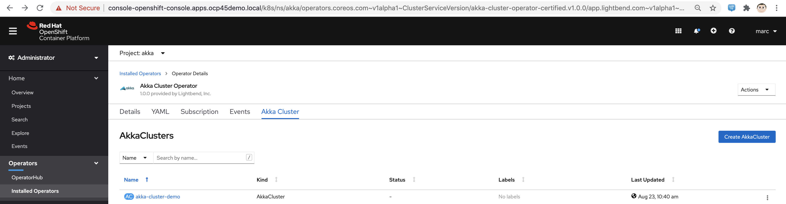
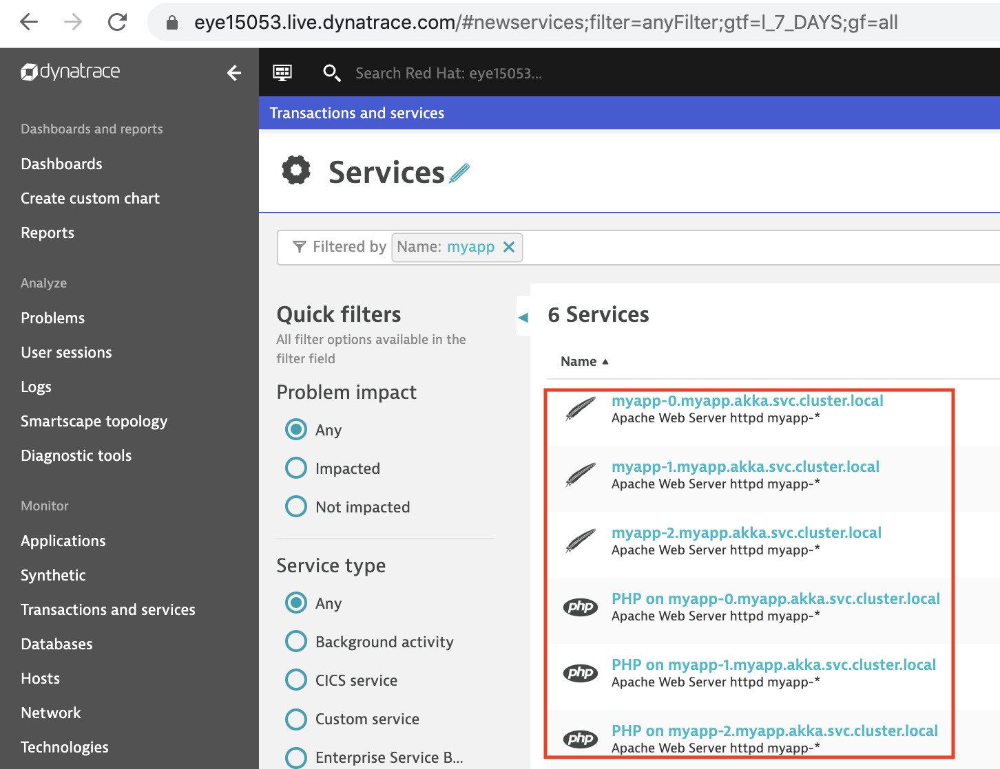
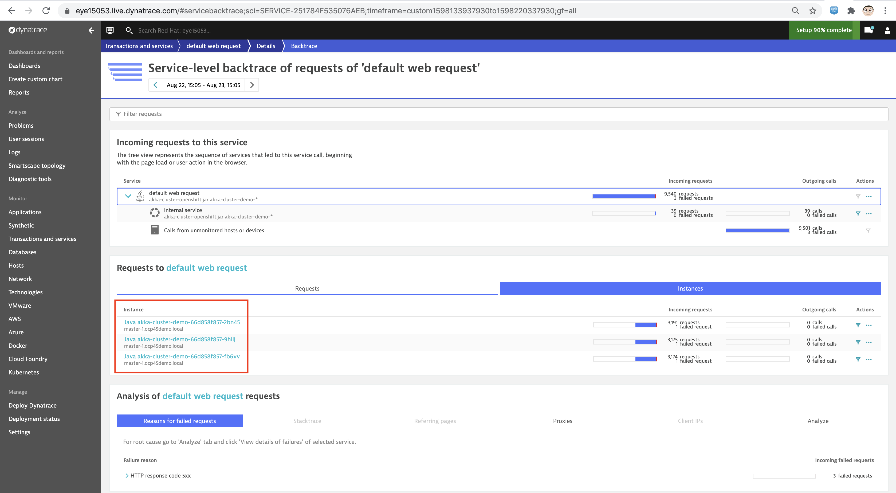
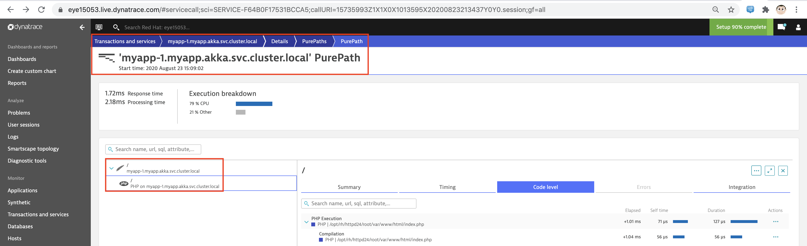

== Deploy Akka Cluster on OpenShift 4.5 and monitor with Dynatrace 

----
We will build and deploy a simple Akka application on OpenShift 4.5 to
demonstrate how you can build an inherently scalable, distributed solution.

Akka is “a set of open-source libraries for designing scalable, resilient systems that span processor cores and networks”. 

Akka Cluster, in particular, enables the distribution of an application over a cluster, thereby lending elasticity to the 
application by automatically scaling out or in with the number of members in the cluster. 

Kubernetes is a container orchestration platform and has the ability to 
automatically scale the number of pods up or down in response to workload. 

Together, the two work in concert: your Akka cluster expands automatically as 
Kubernetes scales the number of pods running for a particular Kubernetes deployment.

One key enabler of this elasticity is the ability for new nodes to join the Akka cluster automatically. 

Akka clusters are a peer-to-peer framework, however some nodes must be designated “seed” nodes 
when the cluster is initialized. 

These serve as an initial point of contact for new nodes. 

When new nodes are brought online, they can join the cluster automatically by first sending a message to
all seed nodes in the cluster, followed by a
“join” command to the seed node that responds first. 

Without seed nodes you would have to manually or programmatically add nodes to the cluster.

This solution uses podman to build a single container image and deploy it to a private quay.io registry. 

We use StatefulSet rather than Deployment to guarantee the orderly startup of seed nodes.
StatefulSet is the workload API object used to manage stateful applications.
StatefulSet manages the deployment and scaling of a set of Pods, and provides guarantees about
the ordering and uniqueness of these Pods.

Like a Deployment, a StatefulSet manages Pods that are based on an identical container spec. 
Unlike a Deployment, a StatefulSet maintains a sticky identity for each of their Pods. 
These pods are created from the same spec, but are not interchangeable: 
each has a persistent identifier that it maintains across any rescheduling.
----

== Watch the step-by-step video

Please see https://youtu.be/7sL9QVEIj_8

== Steps

----
wget https://raw.githubusercontent.com/marcredhat/Akka-cluster-deploy-kubernetes/master/deployall.sh

chmod +x ./deployall.sh

./deployall.sh
----

== Prerequisites

----
* Be logged in to an OpenShift 4.5 cluster
----

----
For details on how to automated the installation of OpenShift 4.5, Service Mesh, 
Dynatrace OneAgent Operator and Keptn
on your laptop or virtual machine using CodeReady Containers, please see
https://github.com/marcredhat/crcdemos/tree/master/keptn

For details on how to fully automate the installation of OpenShift 4.4 and 4.5 (for lab/test purposes)
on a baremetal server with KVM/libvirt, please see 
https://github.com/marcredhat/z/blob/master/zdt.adoc, starting at the
"Install OpenShift 4" paragraph
----

----
* Deploy the Akka Operator and create an Akka Cluster
----

----
* export quayusername="<your quay user name>"
* export quayencryptedpassword="<your quay.io encrypted password>'
* export quayemail="<email used for your quay.io account>"
----

== Dynatrace OneAgent automatically discovers your entire Akka application

----
In a few minutes the Dynatrace OneAgent automatically discovers your entire Akka application. 
Dynatrace monitors and analyzes the database activities of your Akka applications, 
providing you with visibility all the way down to individual SQL and NoSQL statements. 
----

See https://www.dynatrace.com/technologies/java-monitoring/akka/

